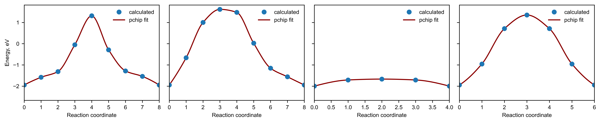

#### About

ions is a python library made for studying percolation in ionic crystals

Functionality includes:

* calculating 1-3D percolation radius of mobile species in crystals

* finding percolation pathway and its inequivalent parts (tests are required)

* calculating activation barrier using nudged elastic band method implementing bond valence force field calculator

* searching for a minimum jump distance of a mobile specie required for 1-3D percolation

* handling data associated with ionic crystals

* decoration of ase's Atoms objects with oxidation states (pymatgen's reimplementaion)


Note:
The library is under active development. Errors are expected. Most of the features are not well documented for now.


#### Installation

```pip install ions```

#### Maximum percolation dimensionality and minimum required jump distance


```python
from ase.io import read, write
from ions.tools import Percolator

file = '/Users/artemdembitskiy/Downloads/LiFePO4.cif'
atoms = read(file)  

specie = 3
pr = Percolator(atoms, specie, 10.0)

tr = 0.5 # Minimum allowed distance between the edge and the framework
cutoff, dim = pr.mincut_maxdim(tr)

print(f'Maximum percolation dimensionality: {dim}')
print(f'Jump distance cutoff: {cutoff} angstrom')
```

    Maximum percolation dimensionality: 3
    Jump distance cutoff: 5.7421875 angstrom


```python
pr.percolation_threshold(1), pr.percolation_threshold(2), pr.percolation_threshold(3)
```


    (1.582, 1.4551, 0.9668)


#### Inequivalent ionic hops forming percolating netwrok


```python
edges, features = pr.unique_edges(cutoff, tr) # list of (source, target, offset_x, offset_y, offset_z)
edges
```


    [Edge(0,1,[0 0 0], d=5.74, wrapped_target=1'),
     Edge(0,3,[1 0 0], d=5.64, wrapped_target=3'),
     Edge(0,3,[0 0 0], d=3.05, wrapped_target=3'),
     Edge(0,0,[1 0 0], d=4.75, wrapped_target=0')]


#### Find saddle point for each ionic hop using bond valence force field potential


```python
import numpy as np
from ase.io import read, write
from ase.optimize import FIRE

from ions.tools import SaddleFinder
from ions.decorator import Decorator
from ions.utils import collect_bvse_params


Decorator().decorate(atoms) # oxidation states are required for this method
collect_bvse_params(atoms, 'Li', +1, self_interaction=True) # do not omit Li-Li interaction
pr = Percolator(atoms, specie, 10.0)
edges, _ = pr.unique_edges(cutoff, tr)

traj = []
for i, edge in enumerate(edges):
    superedge = edge.superedge(10.0, center = True) # put centroid of the edge in the center of the box
    images = superedge.interpolate(spacing = 0.75)
    sf = SaddleFinder()
    neb = sf.bvse_neb(images)
    optim = FIRE(neb,
                    logfile = 'log'
                    )
    traj.append(images)
    optim.run(fmax = 0.1, steps = 100)
    print(f'Unique jump #{i}: Fmax {neb.get_forces().max().round(2)} eV/angstrom |',
         f'Activation barrier {sf.get_barrier(images).round(2)} eV')
```

    Unique jump #0: Fmax 0.07 eV/angstrom | Activation barrier 3.26 eV
    Unique jump #1: Fmax 0.05 eV/angstrom | Activation barrier 3.56 eV
    Unique jump #2: Fmax 0.09 eV/angstrom | Activation barrier 0.33 eV
    Unique jump #3: Fmax 0.05 eV/angstrom | Activation barrier 3.3 eV


#### Plot profile


```python
import matplotlib.pyplot as plt
from scipy.interpolate import pchip_interpolate

plt.rcParams.update({'font.size': 8})
plt.rcParams.update({'font.family': 'Arial'})


fig, axes = plt.subplots(dpi = 600, figsize = (12, 2.5), ncols = len(traj), sharey  = True)
for ax, images in zip(axes, traj):
    profile = sf.get_profile(images)
    x = np.arange(0, len(images))
    x_fit = np.linspace(0, len(images), 100)
    y_fit = pchip_interpolate(x, profile, x_fit)
    ax.plot(x, profile, 'o', label = 'calculated')
    ax.plot(x_fit, y_fit, zorder = 1, label = 'pchip fit', color = 'darkred')
    ax.set_xlabel('Reaction coordinate')
    ax.set_xlim(x.min(), x.max())
    ax.legend(frameon = False)
axes[0].set_ylabel('Energy, eV')
plt.tight_layout()
```


    

    


#### Percolation dimensionality study (I found some inconsistency, don't use until update)


```python
emins = []
emaxs = []
for images in traj:
    
    emins.append(sf.get_profile(images).min())
    emaxs.append(sf.get_profile(images).max())

for d in range(1, dim + 1):
   ea, tr_min, tr_max = pr.propagate_barriers(cutoff, tr, emins, emaxs, d)
   print(f'{d}D percolations barrier: {round(ea, 3)}')

```

    1D percolations barrier: 0.331
    2D percolations barrier: 3.258
    3D percolations barrier: 3.313


#### Put all together


```python
import numpy as np
from ase.io import read, write
from ase.optimize import FIRE
from ions.tools import SaddleFinder
from ions.decorator import Decorator
from ions.utils import collect_bvse_params
import matplotlib.pyplot as plt
from scipy.interpolate import pchip_interpolate

plt.rcParams.update({'font.size': 8})
plt.rcParams.update({'font.family': 'Arial'})


Decorator().decorate(atoms) # oxidation states are required for this method
collect_bvse_params(atoms, 'Li', +1, self_interaction=True) # do not omit Li-Li interaction
pr = Percolator(atoms, specie, 10.0)
edges, _ = pr.unique_edges(cutoff, tr)

traj = []
emins = []
emaxs = []
for i, edge in enumerate(edges):
    superedge = edge.superedge(10.0, center = True) # put centroid of the edge in the center of the box
    images = superedge.interpolate(spacing = 0.75)
    sf = SaddleFinder()
    neb = sf.bvse_neb(images)
    optim = FIRE(neb,
                    logfile = 'log'
                    )
    
    optim.run(fmax = 0.1, steps = 100)
    print(f'Unique jump #{i}: Fmax {neb.get_forces().max().round(2)} eV/angstrom |',
         f'Activation barrier {sf.get_barrier(images).round(2)} eV')
    traj.append(images)
    emins.append(sf.get_profile(images).min())
    emaxs.append(sf.get_profile(images).max())

for d in range(1, dim + 1):
   ea, tr_min, tr_max = pr.propagate_barriers(cutoff, tr, emins, emaxs, d)
   print(f'{d}D percolations barrier: {round(ea, 3)}')


fig, axes = plt.subplots(dpi = 600, figsize = (12, 2.5), ncols = len(traj), sharey  = True)
for ax, images in zip(axes, traj):
    profile = sf.get_profile(images)
    x = np.arange(0, len(images))
    x_fit = np.linspace(0, len(images), 100)
    y_fit = pchip_interpolate(x, profile, x_fit)
    ax.plot(x, profile, 'o', label = 'calculated')
    ax.plot(x_fit, y_fit, zorder = 1, label = 'pchip fit', color = 'darkred')
    ax.set_xlabel('Reaction coordinate')
    ax.set_xlim(x.min(), x.max())
    ax.legend(frameon = False)
axes[0].set_ylabel('Energy, eV')
plt.tight_layout()
```

    Unique jump #0: Fmax 0.07 eV/angstrom | Activation barrier 3.26 eV
    Unique jump #1: Fmax 0.05 eV/angstrom | Activation barrier 3.56 eV
    Unique jump #2: Fmax 0.09 eV/angstrom | Activation barrier 0.33 eV
    Unique jump #3: Fmax 0.05 eV/angstrom | Activation barrier 3.3 eV
    1D percolations barrier: 0.331
    2D percolations barrier: 3.258
    3D percolations barrier: 3.313


    

    


#### Compare with BVSE meshgrid approach (i.e. empty lattice)


```python
from bvlain import Lain

calc = Lain(verbose = False)
atoms = calc.read_file(file)
_ = calc.bvse_distribution(mobile_ion = 'Li1+') # Li-Li interaction is omitted
calc.percolation_barriers()
```


    {'E_1D': 0.4395, 'E_2D': 3.3301, 'E_3D': 3.3594}


One may see that method implemented in bvlain library is much faster and more concise. It can be used for fast prediction of the percolation barriers, while the PathFinder and SaddleFinder can be used as a tool for interpolating local migration trajectory for futher DFT-NEB calculations.

#### Available data

* bv_data - bond valence parameters [1]

* bvse_data - bond valence site energy parameters[2]

* ionic_radii - Shannon ionic radii [3, 4]

* crystal_radii - Shannon crystal radii [3, 4]

* elneg_pauling - Pauling's elenctronegativities [5]


##### References

[1]. https://www.iucr.org/resources/data/datasets/bond-valence-parameters (bvparam2020.cif)

[2]. He, B., Chi, S., Ye, A. et al. High-throughput screening platform for solid electrolytes combining hierarchical ion-transport prediction algorithms. Sci Data 7, 151 (2020). https://doi.org/10.1038/s41597-020-0474-y

[3] http://abulafia.mt.ic.ac.uk/shannon/ptable.php

[4] https://github.com/prtkm/ionic-radii

[5] https://mendeleev.readthedocs.io/en/stable/


### How to handle data


```python
from ions.data import ionic_radii, crystal_radii, bv_data, bvse_data

#ionic radius
symbol, valence = 'V', 4
r_ionic = ionic_radii[symbol][valence]  


#crystal radius
symbol, valence = 'F', -1
r_crystal = crystal_radii[symbol][valence]


# bond valence parameters
source, source_valence = 'Li', 1
target, target_valence = 'O', -2
params = bv_data[source][source_valence][target][target_valence]
r0, b = params['r0'], params['b']


# bond valence site energy parameters
source, source_valence = 'Li', 1
target, target_valence = 'O', -2
params = bvse_data[source][source_valence][target][target_valence]
r0, r_min, alpha, d0  = params['r0'], params['r_min'], params['alpha'], params['d0']
```

### How to decorate ase's Atoms


```python
import numpy as np
from ase.io import read
from ions import Decorator


file = '/Users/artemdembitskiy/Downloads/LiFePO4.cif'
atoms = read(file)
calc = Decorator()
atoms = calc.decorate(atoms)
oxi_states = atoms.get_array('oxi_states')
np.unique(list(zip(atoms.symbols, oxi_states)), axis = 0)

```


    array([['Fe', '2'],
           ['Li', '1'],
           ['O', '-2'],
           ['P', '5']], dtype='<U21')


### Example


```python
import numpy as np
from ions import Decorator
from ase.io import read
from ase.neighborlist import neighbor_list
from ions.data import bv_data

file = '/Users/artemdembitskiy/Downloads/LiFePO4.cif'
atoms = read(file)
calc = Decorator()
atoms = calc.decorate(atoms)
ii, jj, dd = neighbor_list('ijd', atoms, 5.0)  

symbols = atoms.symbols
valences = atoms.get_array('oxi_states')
for i in np.unique(ii):
    source = symbols[i]
    source_valence = valences[i]
    neighbors = jj[ii == i]
    distances = dd[ii == i]
    if source_valence > 0:
        bvs = 0
        for n, d in zip(neighbors, distances):
            target = symbols[n]
            target_valence = valences[n]
            if source_valence * target_valence < 0:
                params = bv_data[source][source_valence][target][target_valence]
                r0, b = params['r0'], params['b']
                bvs += np.exp((r0 - d) / b)
        print(f'Bond valence sum for {source} is {round(bvs, 4)}')

```

    Bond valence sum for Li is 1.0775
    Bond valence sum for Li is 1.0775
    Bond valence sum for Li is 1.0775
    Bond valence sum for Li is 1.0775
    Bond valence sum for Fe is 1.8394
    Bond valence sum for Fe is 1.8394
    Bond valence sum for Fe is 1.8394
    Bond valence sum for Fe is 1.8394
    Bond valence sum for P is 4.6745
    Bond valence sum for P is 4.6745
    Bond valence sum for P is 4.6745
    Bond valence sum for P is 4.6745


```python
!jupyter nbconvert --to markdown example.ipynb
```

    [NbConvertApp] Converting notebook example.ipynb to markdown
    [NbConvertApp] Support files will be in example_files/
    [NbConvertApp] Writing 10819 bytes to example.md

