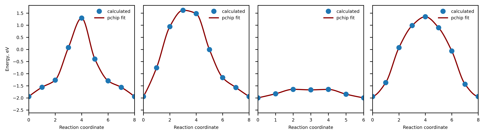

#### About

ions is a python library made for studying percolation in ionic crystals

Functionality includes:

* calculating 1-3D percolation radius of mobile species in crystals

* finding percolation pathway and its inequivalent parts (tests are required)

* calculating activation barrier using nudged elastic band method implementing bond valence force field calculator

* searching for a minimum jump distance of a mobile specie required for 1-3D percolation

* handling data associated with ionic crystals

* decoration of ase's Atoms objects with oxidation states (pymatgen's reimplementaion)


Note:
The library is under active development. Errors are expected. Most of the features are not well documented for now.


#### Installation

```pip install ions```

#### Percolation barriers


```python
import numpy as np
from ase.io import read, write
from ase.optimize import FIRE

from ions.tools import Perconeb
from ions.decorator import Decorator


file = '/Users/artemdembitskiy/Downloads/LiFePO4.cif'
atoms = read(file)  
Decorator().decorate(atoms)

specie = 3 # Li
upper_bound = 10.0
pn = Perconeb(atoms = atoms, specie = specie, upper_bound = upper_bound, self_interaction=True)

traj = pn.percolating_jumps(tr = 0.5, min_sep_dist=10.0, spacing = 0.5)
for i, images in enumerate(traj):
    neb = pn.create_neb(images, k = 5.0) # Note that images are linked to the neb object and will be changed after optimization
    optimizer = FIRE(neb, logfile = 'log')
    optimizer.run(fmax =.1, steps = 100)
    print(f'Unique jump #{i}: Fmax {neb.get_forces().max().round(2)} eV/angstrom |',
          f'Activation barrier {pn.sf.get_barrier(images).round(2)} eV')
```

    Unique jump #0: Fmax 0.08 eV/angstrom | Activation barrier 3.26 eV
    Unique jump #1: Fmax 0.06 eV/angstrom | Activation barrier 3.56 eV
    Unique jump #2: Fmax 0.09 eV/angstrom | Activation barrier 0.35 eV
    Unique jump #3: Fmax 0.07 eV/angstrom | Activation barrier 3.3 eV


#### Plot profile


```python
import matplotlib.pyplot as plt
from scipy.interpolate import pchip_interpolate

plt.rcParams.update({'font.size': 6})


fig, axes = plt.subplots(dpi = 600, figsize = (9, 2.5), ncols = len(traj), sharey  = True)
for ax, images in zip(axes, traj):
    profile = pn.sf.get_profile(images)
    x = np.arange(0, len(images))
    x_fit = np.linspace(0, len(images), 100)
    y_fit = pchip_interpolate(x, profile, x_fit)
    ax.plot(x, profile, 'o', label = 'calculated')
    ax.plot(x_fit, y_fit, zorder = 1, label = 'pchip fit', color = 'darkred')
    ax.set_xlabel('Reaction coordinate')
    ax.set_xlim(x.min(), x.max())
    ax.legend(frameon = False)
axes[0].set_ylabel('Energy, eV')
plt.tight_layout()
```


    

    


#### Percolation dimensionality study


```python
emin = []
emax = []
for images in traj:
    emin.append(pn.sf.get_profile(images).min())
    emax.append(pn.sf.get_profile(images).max())

dim, cutoff = pn.mincut_maxdim(tr = 0.5)
edges, ids, inverse = pn.unique_edges(cutoff = cutoff, dim = dim, tr = 0.5)
mask = pn._filter_edges(tr = 0.5, cutoff = cutoff)
percoedges = pn.u[mask][:, :2]

emins = np.array(emin)[inverse]
emaxs = np.array(emax)[inverse]
dims = np.array([2, 4, 8])
dims = dims[dims <= dim]
percolation_profile = {}
dim_edges = {}
for i, dim_ in enumerate(dims):
    e_a, tr_min, tr_max = pn.propagate_barriers(dim_, percoedges, emins, emaxs)
    print(f'Activation barrier of {i + 1}D percolation: {round(e_a, 3)} eV')
```

    Activation barrier of 1D percolation: 0.35 eV
    Activation barrier of 2D percolation: 3.26 eV
    Activation barrier of 3D percolation: 3.314 eV


#### Available data

* bv_data - bond valence parameters [1]

* bvse_data - bond valence site energy parameters[2]

* ionic_radii - Shannon ionic radii [3, 4]

* crystal_radii - Shannon crystal radii [3, 4]

* elneg_pauling - Pauling's elenctronegativities [5]


##### References

[1]. https://www.iucr.org/resources/data/datasets/bond-valence-parameters (bvparam2020.cif)

[2]. He, B., Chi, S., Ye, A. et al. High-throughput screening platform for solid electrolytes combining hierarchical ion-transport prediction algorithms. Sci Data 7, 151 (2020). https://doi.org/10.1038/s41597-020-0474-y

[3] http://abulafia.mt.ic.ac.uk/shannon/ptable.php

[4] https://github.com/prtkm/ionic-radii

[5] https://mendeleev.readthedocs.io/en/stable/


### How to handle data


```python
from ions.data import ionic_radii, crystal_radii, bv_data, bvse_data

#ionic radius
symbol, valence = 'V', 4
r_ionic = ionic_radii[symbol][valence]  


#crystal radius
symbol, valence = 'F', -1
r_crystal = crystal_radii[symbol][valence]


# bond valence parameters
source, source_valence = 'Li', 1
target, target_valence = 'O', -2
params = bv_data[source][source_valence][target][target_valence]
r0, b = params['r0'], params['b']


# bond valence site energy parameters
source, source_valence = 'Li', 1
target, target_valence = 'O', -2
params = bvse_data[source][source_valence][target][target_valence]
r0, r_min, alpha, d0  = params['r0'], params['r_min'], params['alpha'], params['d0']
```

### How to decorate ase's Atoms


```python
import numpy as np
from ase.io import read
from ions import Decorator


file = '/Users/artemdembitskiy/Downloads/LiFePO4.cif'
atoms = read(file)
calc = Decorator()
atoms = calc.decorate(atoms)
oxi_states = atoms.get_array('oxi_states')
np.unique(list(zip(atoms.symbols, oxi_states)), axis = 0)

```


    array([['Fe', '2'],
           ['Li', '1'],
           ['O', '-2'],
           ['P', '5']], dtype='<U21')


### Example


```python
import numpy as np
from ions import Decorator
from ase.io import read
from ase.neighborlist import neighbor_list
from ions.data import bv_data

file = '/Users/artemdembitskiy/Downloads/LiFePO4.cif'
atoms = read(file)
calc = Decorator()
atoms = calc.decorate(atoms)
ii, jj, dd = neighbor_list('ijd', atoms, 5.0)  

symbols = atoms.symbols
valences = atoms.get_array('oxi_states')
for i in np.unique(ii):
    source = symbols[i]
    source_valence = valences[i]
    neighbors = jj[ii == i]
    distances = dd[ii == i]
    if source_valence > 0:
        bvs = 0
        for n, d in zip(neighbors, distances):
            target = symbols[n]
            target_valence = valences[n]
            if source_valence * target_valence < 0:
                params = bv_data[source][source_valence][target][target_valence]
                r0, b = params['r0'], params['b']
                bvs += np.exp((r0 - d) / b)
        print(f'Bond valence sum for {source} is {round(bvs, 4)}')

```

    Bond valence sum for Li is 1.0775
    Bond valence sum for Li is 1.0775
    Bond valence sum for Li is 1.0775
    Bond valence sum for Li is 1.0775
    Bond valence sum for Fe is 1.8394
    Bond valence sum for Fe is 1.8394
    Bond valence sum for Fe is 1.8394
    Bond valence sum for Fe is 1.8394
    Bond valence sum for P is 4.6745
    Bond valence sum for P is 4.6745
    Bond valence sum for P is 4.6745
    Bond valence sum for P is 4.6745

